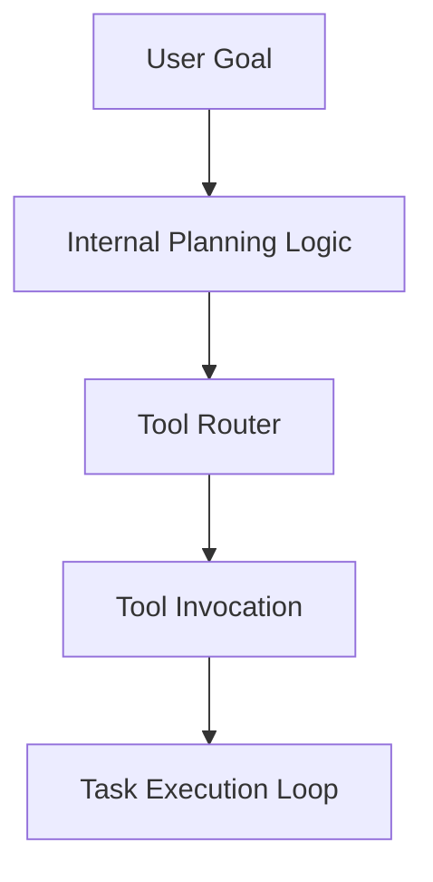

# Agent Layer

Draft status: Not drafted.

Purpose: Reserve space for agent and tool-use terms.

Evidence requirement: Future agent terms must separate runtime behavior,
controls, and unsupported capability notes.

## Boundary Descriptions

* **Input Boundary**: Neutral placeholder for user and environment input interfaces.
* **Output Boundary**: Neutral placeholder for actions, tool invocations, and agent responses.
* **Internal Scope**: Placeholder boundary definitions for internal planning, routing, and task execution logic.

## Architecture Diagram

