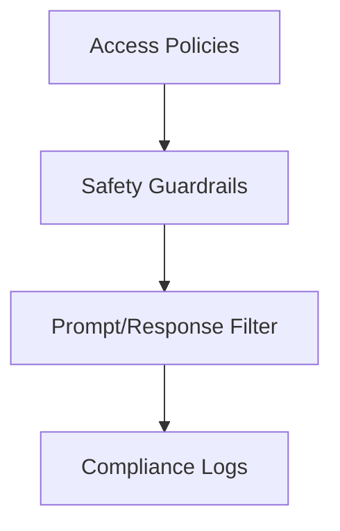

# Governance Layer

Draft status: Not drafted.

Purpose: Reserve space for safety, policy, and operational control terms.

Evidence requirement: Future governance terms must separate policy language
from measured system behavior.

## Boundary Descriptions

* **Input Boundary**: Neutral placeholder for operational policies, access controls, and safety filters.
* **Output Boundary**: Neutral placeholder for policy decisions, compliance logs, and enforcement actions.
* **Internal Scope**: Placeholder boundary definitions for policy validation, safety checks, and control enforcement modules.

## Architecture Diagram

## Sub-layer Components

* **Access Controller**: Neutral placeholder for managing permissions and workspace isolation.
* **Safety Filter**: Neutral placeholder for prompt injection scanning and output validation.
* **Audit Logger**: Neutral placeholder for recording policy actions and compliance metrics.

