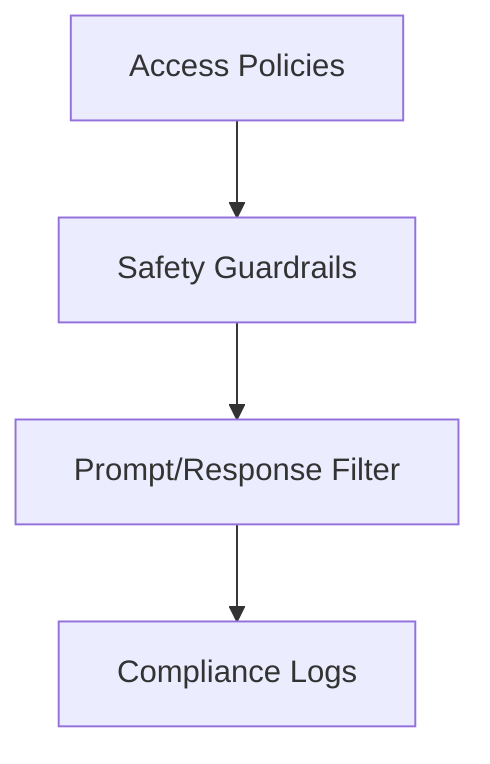

# Governance Layer

Draft status: Not drafted.

Purpose: Reserve space for safety, policy, and operational control terms.

Evidence requirement: Future governance terms must separate policy language
from measured system behavior.

## Boundary Descriptions

* **Input Boundary**: Intercept incoming client request parameters, user credentials, and tools execution requests at the gateway.
* **Output Boundary**: Enforce safety decisions (block/allow prompt execution, tool execution limits) and write compliance reports.
* **Internal Scope**: Validate access privileges, match inputs against injection patterns (Base64 decoders, roleplay framing, tool command blacklists), and monitor resource usage budgets.

## Architecture Diagram

## Sub-layer Components

* **Access Controller**: Enforce workspace separation rules and track token rate limits.
* **Safety Filter**: Execute heuristic regex scanning, adversarial string checks, and base64 parsing on inputs and outputs.
* **Audit Logger**: Log policy breaches, security actions, and compliance reports to non-repudiable databases.

