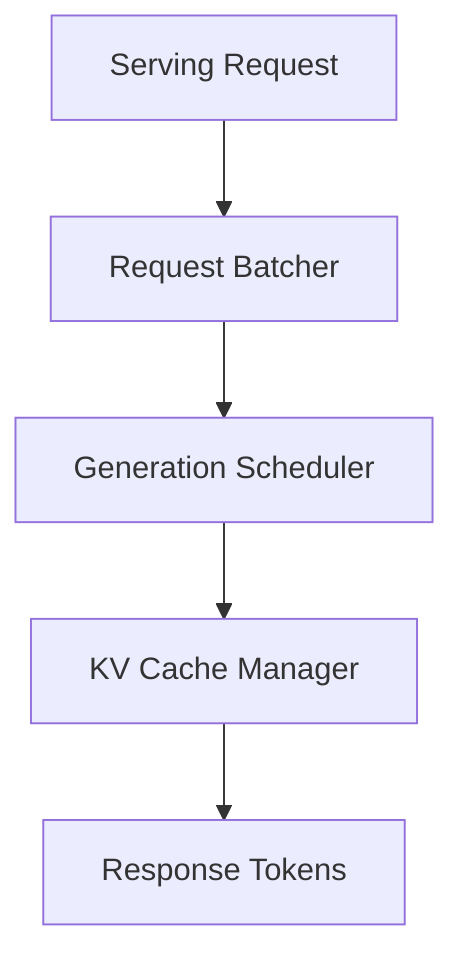

# Inference Layer

Draft status: Not drafted.

Purpose: Reserve space for serving and runtime terms.

Evidence requirement: Future runtime claims must reference approved ledger
sources before paper use.

## Boundary Descriptions

* **Input Boundary**: Consumes client HTTP serving requests containing the prompt string, generation hyperparameters (temperature, top_p), and max token limit.
* **Output Boundary**: Streams generated token characters to clients via HTTP Server-Sent Events (SSE) or returns completed response JSON.
* **Internal Scope**: Manages request batching (continuous/dynamic batching), scheduling token generation loops, and optimizing KV Cache allocation (e.g. using PagedAttention to prevent memory fragmentation).

## Architecture Diagram

