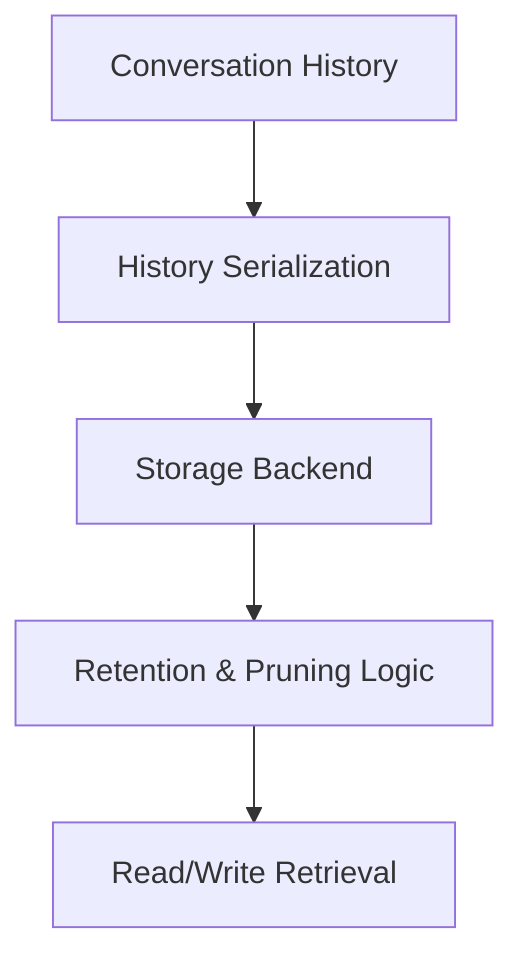

# Memory Layer

Draft status: Not drafted.

Purpose: Reserve space for memory-related terms.

Evidence requirement: Future memory terms must include provenance requirements
before content drafting.

## Boundary Descriptions

* **Input Boundary**: Neutral placeholder for conversational history, semantic writes, and memory updates.
* **Output Boundary**: Neutral placeholder for historical context, read retrievals, and state summaries.
* **Internal Scope**: Placeholder boundary definitions for state serialization, storage backends, and retention/pruning logic.

## Architecture Diagram

