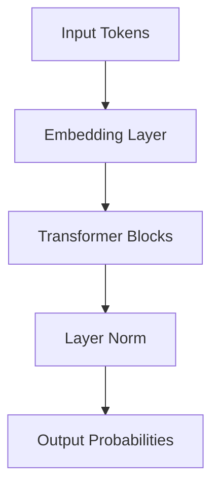

# Model Layer

Draft status: Not drafted.

Purpose: Reserve space for model architecture terms.

Evidence requirement: Future definitions must reference approved ledger sources
before becoming taxonomy content.

## Boundary Descriptions

* **Input Boundary**: Neutral placeholder for input tokens, embeddings, and forward pass options.
* **Output Boundary**: Neutral placeholder for hidden states, output probabilities, and prediction outputs.
* **Internal Scope**: Placeholder boundary definitions for model blocks, attention heads, layer norms, and parameter configurations.

## Architecture Diagram

