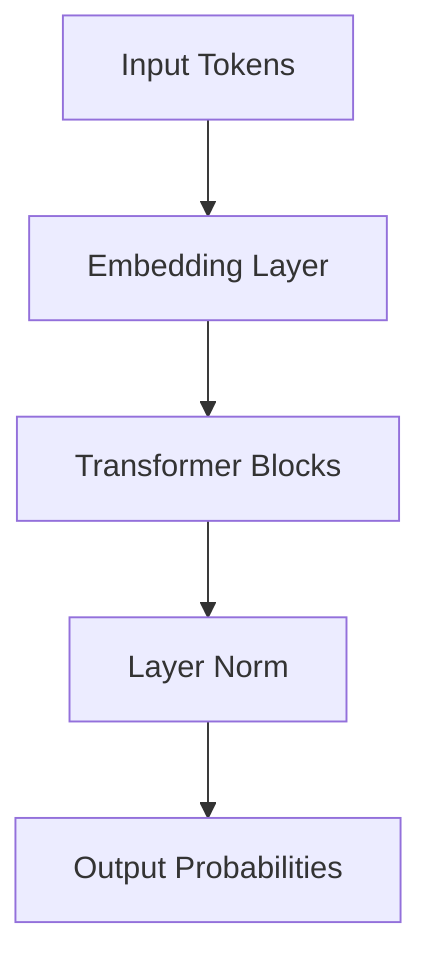

# Model Layer

Draft status: Not drafted.

Purpose: Reserve space for model architecture terms.

Evidence requirement: Future definitions must reference approved ledger sources
before becoming taxonomy content.

## Boundary Descriptions

* **Input Boundary**: Maps incoming input token integers to dense vector embeddings combined with positional encodings, feeding them into the network blocks.
* **Output Boundary**: Extracts the final layer's hidden states to compute logits representing the probability distribution over the vocabulary.
* **Internal Scope**: Encompasses the stack of Transformer blocks containing multi-head self-attention, layer normalization, residual connections, and feed-forward networks.

## Architecture Diagram

