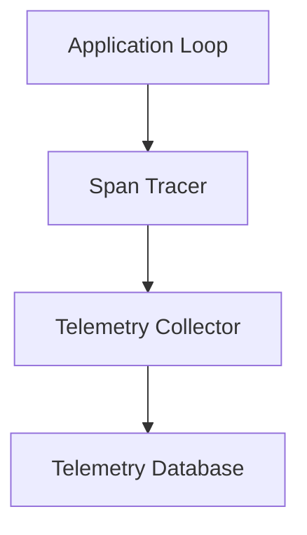

# Observability Layer

Draft status: Not drafted.

Purpose: Reserve space for observability, tracing, and logging terms.

Evidence requirement: Future observability terms must reference approved
research ledger evidence.

## Boundary Descriptions

* **Input Boundary**: Capture function execution entries, API request headers carrying trace parent context (W3C Trace Context), and log parameters.
* **Output Boundary**: Export trace spans and structured logs to standard JSON streams or remote OpenTelemetry collectors.
* **Internal Scope**: Create spans hierarchically matching request execution operations, measure duration offsets, and format structured telemetry events.

## Architecture Diagram

## Sub-layer Components

* **Span Tracer**: Instrument components using trace contexts, instantiating parent-child span relationships with unique IDs.
* **Metric Exporter**: Consolidate performance statistics like latency, tokens per second, and GPU queue lengths for operational reporting.
* **Alert Manager**: Trigger alert events when latency thresholds are exceeded or model safety filters detect systematic violations.
