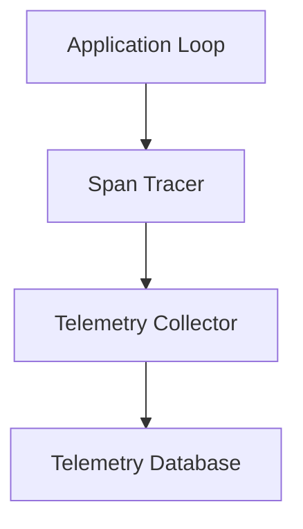

# Observability Layer

Draft status: Not drafted.

Purpose: Reserve space for observability, tracing, and logging terms.

Evidence requirement: Future observability terms must reference approved
research ledger evidence.

## Boundary Descriptions

* **Input Boundary**: Neutral placeholder for collector endpoints and tracing context headers.
* **Output Boundary**: Neutral placeholder for exported telemetry spans, logs, and alert triggers.
* **Internal Scope**: Placeholder boundary definitions for span generation, event logging, and local metric counters.

## Architecture Diagram

## Sub-layer Components

* **Span Tracer**: Neutral placeholder for instrumentation, span creation, and tracing context.
* **Metric Exporter**: Neutral placeholder for system telemetry collection and counter reporting.
* **Alert Manager**: Neutral placeholder for processing logs and triggering operational alerts.
