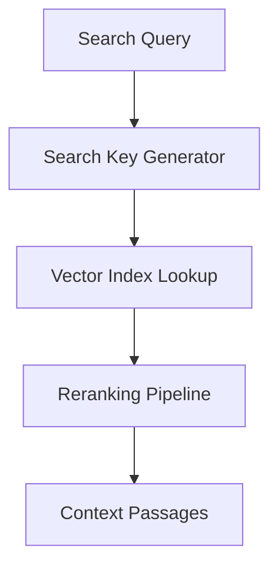

# Retrieval Layer

Draft status: Not drafted.

Purpose: Reserve space for retrieval and grounding terms.

Evidence requirement: Future retrieval terms must avoid unsupported performance
or quality claims.

## Boundary Descriptions

* **Input Boundary**: Neutral placeholder for queries, search keys, and retrieval constraints.
* **Output Boundary**: Neutral placeholder for retrieved documents, context passages, and retrieval scores.
* **Internal Scope**: Placeholder boundary definitions for search index, vector space retrieval, ranking, and reranking pipelines.

## Architecture Diagram

