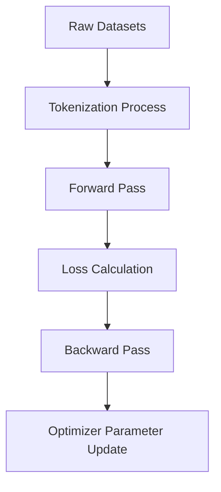

# Training Layer

Draft status: Not drafted.

Purpose: Reserve space for training and adaptation terms.

Evidence requirement: Future definitions must distinguish supported evidence
from planning notes.

## Boundary Descriptions

* **Input Boundary**: Neutral placeholder for raw dataset files, training configurations, and hyperparameters.
* **Output Boundary**: Neutral placeholder for trained weights, checkpoints, and optimization curves.
* **Internal Scope**: Placeholder boundary definitions for optimizers, loss functions, tokenization, and parameter updates.

## Architecture Diagram

